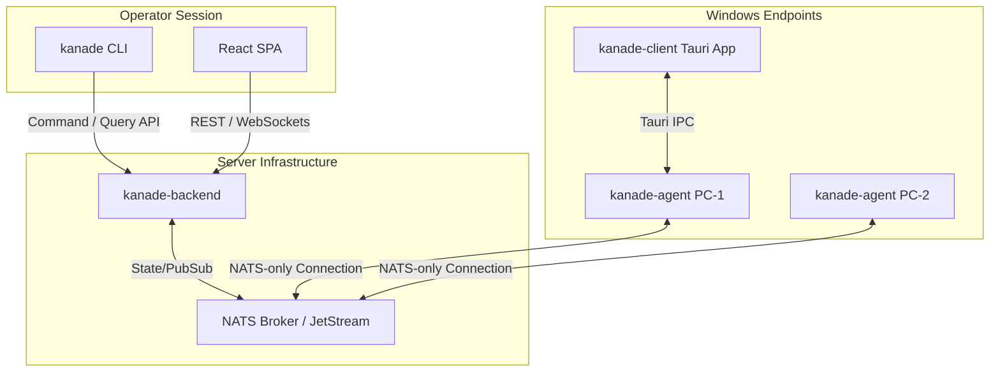

# System Architecture

`kanade` is designed to manage hundreds of Windows endpoints concurrently, safely, and asynchronously. 

## Component Topology

The system consists of five main components, coordinated through an event-driven pub/sub structure:

### 1. kanade-agent
A high-performance Windows service running on each managed host.
- **Role**: Core executor.
- **Communication**: Establishes an outbound-only NATS connection. It does not open any inbound ports, making it firewall-friendly.
- **Capabilities**: Launches secure, isolated PowerShell subprocesses, inventories hardware/software specs, streams live performance data (CPU, RSS memory, disk I/O), and manages local packages.

### 2. kanade-backend
The central HTTP API and projection server.
- **Role**: Coordinates commands, processes incoming telemetry, and hosts the operator Web interface.
- **State management**: Persists events, activity logs, and status records in a localized SQLite database.
- **Projector pattern**: Subscribes to the NATS command-response stream, parses incoming payloads, and projects them into state tables in real-time.

### 3. NATS Broker (with JetStream)
The message transport layer of the entire fleet.
- **Role**: Lightweight, high-throughput message broker.
- **JetStream**: Retains command streams, job registrations, and file storage (using NATS Object Store buckets for distributing packages and agent scripts).
- **Isolation**: Decouples the backend from the agents. If the backend is offline or restarting, agents continue execution and cache outbox records, pushing them once connection resumes.

### 4. kanade-client
An optional Tauri desktop application running in the logged-in user's desktop session on endpoints.
- **Role**: Provides end-user interaction (e.g., prompt dialogs, notifications, or a user-facing dashboard).
- **Communication**: Shares state with the local `kanade-agent` via secured local IPC mechanisms.

### 5. kanade CLI
The primary command-line tool for operators.
- **Role**: Packages and publishes software updates, submits and executes job manifests, and queries live fleet inventory from the command-line.

---

## Security & Reliability Design

### Outbound-only Connections
Agents strictly communicate with the NATS broker by initiating outbound TCP connections. No firewall ports need to be opened on endpoints, neutralizing the risk of lateral traversal or external port scanning.

### Agent Job Sandboxing
When executing scripts, the agent stages commands in `%ProgramData%\Kanade\agent-scripts` and executes them using customized launcher templates. 
Administrators can enforce identity configurations via job manifests, specifying `run_as: system` (for elevated system management) or `run_as: user` (to run safely under the active user's credentials with restricted directory ACLs).
